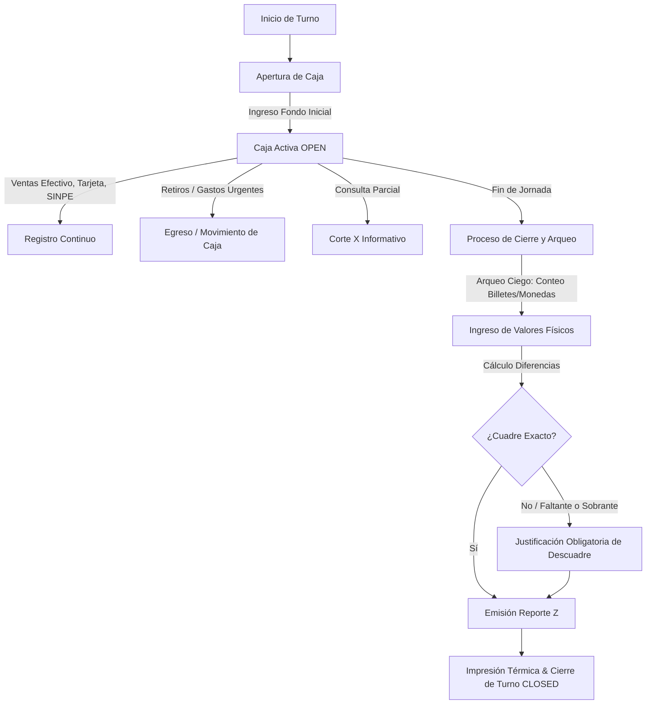

# Plan de Arquitectura: Sistema de Turnos/Caja y Control de Suscriptores SaborAI

## 1. Visión General
Este documento detalla la arquitectura técnica, modelo de datos y flujos de experiencia de usuario para dos componentes neurálgicos de **SaborAI**:
1. **Sistema de Apertura, Operativa y Cierre de Turno y Caja (Cash Drawer & Shift Management)**: Control de flujos de efectivo, arqueo ciego, egresos e ingresos de caja, cuadre multimoneda (Colones y Dólares), propinas de ley y emisión de Reporte Z.
2. **Sistema de Control de Suscriptores a Planes SaborAI (SaaS Subscription & Tenant Management)**: Gobernanza de clientes de los planes Express, Pro y Multisucursal, ciclo de facturación recurrente con Tilopay/SINPE, períodos de gracia, límites de plan y sincronización bidireccional con Notion.

---

## 2. Sistema de Apertura y Cierre de Turno y Caja

### 2.1 Modelo de Datos Propuesto (`src/types/cashShift.ts`)
```typescript
export type ShiftStatus = 'OPEN' | 'CLOSING' | 'CLOSED';
export type CashMovementType = 'INFLOW' | 'OUTFLOW' | 'TIP_WITHDRAWAL';

export interface CashDenominationBreakdown {
  // Billetes CRC
  bills20000: number;
  bills10000: number;
  bills5000: number;
  bills2000: number;
  bills1000: number;
  // Monedas CRC
  coins500: number;
  coins100: number;
  coins50: number;
  coins25: number;
  coins10: number;
  coins5: number;
  // Divisas USD (opcional)
  usdCashTotal?: number;
}

export interface CashMovement {
  id: string;
  shiftId: string;
  timestamp: Date;
  type: CashMovementType;
  amount: number;
  reason: string;
  authorizedBy: string; // Admin o Gerente
  performedBy: string;  // Cajero en turno
}

export interface CashShift {
  id: string;
  shiftNumber: number;
  tenantId: string;
  terminalId: string;
  openedBy: {
    userId: string;
    userName: string;
    userRole: string;
  };
  openedAt: Date;
  initialCashFloat: number; // Fondo de caja inicial
  status: ShiftStatus;

  // Movimientos durante el turno
  movements: CashMovement[];

  // Cierre y Arqueo
  closedBy?: {
    userId: string;
    userName: string;
  };
  closedAt?: Date;
  
  // Resumen calculado por sistema (Expected)
  systemSummary?: {
    cashSales: number;
    cardSales: number;
    sinpeSales: number;
    totalSales: number;
    totalTax: number;
    serviceTax10: number;
    totalInflows: number;
    totalOutflows: number;
    expectedCashInDrawer: number; // Fondo + Ventas Efectivo + Entradas - Salidas
    invoicesCount: number;
  };

  // Conteo físico real del cajero (Actual)
  countedCash?: number;
  cashBreakdown?: CashDenominationBreakdown;
  countedCards?: number; // Total vouchers datáfono
  countedSinpe?: number; // Total transferencias SINPE verificadas
  
  // Balance
  cashDifference?: number; // countedCash - expectedCashInDrawer (0: exacto, <0: faltante, >0: sobrante)
  differenceReason?: string;
  
  zReportGenerated?: boolean;
}
```

### 2.2 Flujo Operativo Óptimo


---

## 3. Sistema de Control de Suscriptores SaaS SaborAI

### 3.1 Modelo de Datos del Suscriptor (`src/types/subscription.ts`)
```typescript
export type PlanTier = 'express' | 'pro' | 'multibranch';
export type SubscriptionState = 'TRIAL' | 'ACTIVE' | 'GRACE_PERIOD' | 'SUSPENDED' | 'CANCELLED';

export interface PlanLimits {
  maxTerminals: number;
  maxTables: number;
  maxStaff: number;
  hasKds: boolean;
  hasInventoryRecipes: boolean;
  hasAiCopilot: boolean;
  hasMultiBranch: boolean;
}

export interface SubscriberTenant {
  id: string;
  businessName: string;
  commercialName: string;
  legalId: string; // Cédula jurídica/física
  adminEmail: string;
  adminPhone: string;
  location: {
    province: string;
    canton: string;
    address: string;
  };
  subscription: {
    plan: PlanTier;
    status: SubscriptionState;
    monthlyPriceCrc: number;
    billingCycle: 'MONTHLY' | 'ANNUAL';
    currentPeriodStart: Date;
    currentPeriodEnd: Date;
    gracePeriodDays: number;
    gracePeriodEndsAt?: Date;
    lastPaymentDate?: Date;
    lastPaymentRef?: string;
    paymentMethod: 'TILOPAY_CARD' | 'SINPE_MOVIL' | 'TRANSFERENCIA';
    tilopayCustomerToken?: string;
  };
  metrics: {
    totalOrdersProcessed: number;
    totalRevenueTrackedCrc: number;
    activeTerminalsCount: number;
  };
  notionSyncStatus: 'SYNCED' | 'PENDING' | 'ERROR';
  lastNotionSync?: Date;
}
```

### 3.2 Gobernanza de Estados y Período de Gracia
1. **Activo (`ACTIVE`)**: Acceso pleno a todas las funcionalidades del plan contratado.
2. **Período de Gracia (`GRACE_PERIOD`)**:
   - Se activa automáticamente si la tarjeta Tilopay es rechazada o el SINPE no se reporta al vencer la mensualidad.
   - **Duración**: 5 días hábiles.
   - **Comportamiento**: El POS **continúa 100% operativo** para no entorpecer el servicio ni los cobros a los comensales. Se muestra un banner elegante para el administrador: *"Tu mensualidad SaborAI se encuentra pendiente. Tienes 4 días de gracia para regularizar sin interrupción."* con botón directo de pago rápido.
3. **Suspendido (`SUSPENDED`)**:
   - Vencido el período de gracia sin pago, se bloquea la apertura de nuevas comandas o cobros.
   - Se muestra pantalla de reactivación inmediata con pasarela de pago o SINPE Móvil. Al confirmar el pago, el sistema se desbloquea al instante.

---

## 4. Plan de Implementación de Componentes

### Componentes de Caja:
- `CashShiftModal.tsx`: Modal para apertura de turno (fondo inicial) y cierre con arqueo interactivo por denominaciones (billetes y monedas de CR).
- `CashMovementsModal.tsx`: Registro de egresos (salidas de efectivo por compras menores) o ingresos para inyecciones de cambio.
- `ZReportThermal.tsx`: Vista previa y formato de impresión de ticket Reporte Z para impresoras térmicas de 80mm y 58mm.

### Componentes de Suscriptores:
- `SuperAdminBackoffice.tsx`: Módulo enriquecido con control de altas, suspensiones, extensiones de período de gracia, analítica de MRR y control de sucursales.
- `PlanGatekeeper.tsx`: Validador de permisos y límites según el plan activo (Express, Pro, Multisucursal).
